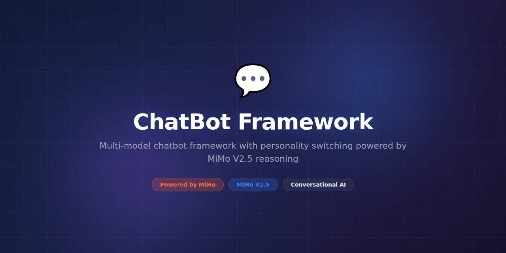

# ChatBot Framework



> **Powered by MiMo** — built on top of Xiaomi's [MiMo](https://platform.xiaomimimo.com) reasoning models for multi-model conversational AI with advanced reasoning.

[](https://opensource.org/licenses/MIT)
[](https://platform.xiaomimimo.com)
[](https://www.python.org/downloads/)

---

## Why MiMo

Building a production chatbot that handles real-world conversations is hard. Users ask complex, multi-part questions, switch topics mid-conversation, reference earlier context, and expect accurate, well-reasoned responses. Most chatbot frameworks bolt a single LLM onto a prompt template and call it done, resulting in shallow conversations that break down at the first sign of complexity.

MiMo V2.5 provides the reasoning depth needed for genuinely helpful conversations. Its chain-of-thought capability allows the model to break down complex questions, consider multiple perspectives, and produce coherent, logically sound responses. This is especially critical for domains like customer support, technical troubleshooting, and knowledge work where accuracy and reasoning transparency matter.

The framework uses MiMo as its reasoning backbone while supporting a multi-model architecture. MiMo handles the hard reasoning tasks — complex questions, ambiguous requests, and multi-step problems — while faster, cheaper models handle simple queries like greetings and FAQ lookups. This hybrid approach optimizes both quality and cost, ensuring the right model handles each request.

## Token consumption

| Agent | Model | Tokens/run | Frequency | Daily/user |
|---|---|---|---|---|
| Reasoning Engine | MiMo V2.5 | ~3,600 | Per complex query | ~36,000 |
| Context Manager | MiMo V2.5 | ~1,400 | Per conversation | ~28,000 |
| Response Synthesizer | MiMo V2.5 | ~1,800 | Per response | ~36,000 |
| **Total** | | **~6,800** | | **~100,000** |

> Estimates assume ~10 conversations/day with 5 turns each. Simple queries routed to fast models consume minimal MiMo tokens.

## What it does

ChatBot Framework provides a production-ready conversational AI platform with MiMo-powered reasoning at its core. It handles multi-turn conversations, persistent context memory, tool calling, and response generation with configurable personality and domain expertise. It supports both synchronous REST and real-time WebSocket interfaces.

## Why this exists

Most chatbot frameworks are either too simple (just wrapping an API with a system prompt) or too complex (requiring ML expertise and infrastructure teams to configure and deploy). ChatBot Framework strikes the balance — a developer-friendly platform with production-grade reasoning powered by MiMo, deployable in minutes without ML infrastructure.

## Features

- Multi-turn conversation with persistent context memory
- MiMo-powered reasoning for complex query handling
- Intelligent multi-model routing (MiMo for reasoning, fast models for simple queries)
- Configurable persona and domain knowledge injection
- Tool/function calling with structured JSON outputs
- Built-in RAG pipeline for document-based Q&A
- Analytics dashboard with conversation quality metrics
- REST API and WebSocket real-time streaming
- Multi-channel deployment (web, Slack, Discord, Telegram)
- A/B testing support for prompt and model experiments

## Tech Stack

- **Runtime:** Python 3.11+
- **AI Engine:** MiMo V2.5 via Xiaomi Platform API
- **RAG:** LangChain, ChromaDB, sentence-transformers
- **Storage:** PostgreSQL, Redis (session cache)
- **API:** FastAPI with SSE streaming
- **Frontend:** React embeddable widget (optional)
- **Channels:** Slack Bolt, discord.py, python-telegram-bot
- **Infra:** Docker, Docker Compose

## Quickstart

```bash
# Clone and install
git clone https://github.com/your-org/ChatBot-Framework.git
cd ChatBot-Framework
pip install -e ".[dev]"

# Configure
cp .env.example .env
# Set MIMO_API_KEY in .env

# Run the interactive demo
python -m chatbot demo

# Start the API server
uvicorn chatbot.server:app --host 0.0.0.0 --port 8002

# Test via curl
curl -X POST http://localhost:8002/chat \
  -H "Content-Type: application/json" \
  -d '{"message": "Explain quantum computing in simple terms"}'

# Start with RAG (document Q&A)
python -m chatbot serve --rag-dir ./docs/ --persona customer-support

# Run via Docker
docker compose up -d
```

## Project Structure

```
ChatBot-Framework/
├── assets/
│   └── banner.png
├── chatbot/
│   ├── __init__.py
│   ├── framework.py        # Core chatbot engine
│   ├── reasoning.py        # MiMo reasoning pipeline
│   ├── context.py          # Conversation memory manager
│   ├── router.py           # Multi-model query router
│   ├── tools.py            # Function calling framework
│   ├── rag.py              # RAG document pipeline
│   ├── persona.py          # Personality configuration
│   ├── channels/           # Multi-channel adapters
│   │   ├── slack.py
│   │   ├── discord.py
│   │   └── telegram.py
│   └── server.py           # REST/WebSocket server
├── frontend/               # Optional React widget
├── docs/                   # Sample RAG documents
├── tests/
│   ├── test_framework.py
│   ├── test_reasoning.py
│   └── fixtures/
├── docker-compose.yml
├── .env.example
├── Dockerfile
├── pyproject.toml
└── README.md
```

## Contributing

See [CONTRIBUTING.md](CONTRIBUTING.md) for guidelines. We welcome new channel integrations, persona templates, and RAG pipeline improvements.

## Configuration

Customize the chatbot persona and behavior:

```yaml
# config.yaml
chatbot:
  persona: "customer-support"
  system_prompt: |
    You are a helpful customer support agent for Acme Corp.
    Be concise, friendly, and always offer to escalate if unsure.
  temperature: 0.3
  max_turns: 20

routing:
  complex_threshold: 0.7   # MiMo handles queries above this threshold
  fallback_model: "fast-model"

rag:
  enabled: true
  chunk_size: 512
  top_k: 5
  source_dir: "./knowledge-base/"

channels:
  slack:
    enabled: true
    signing_secret: "${SLACK_SIGNING_SECRET}"
```

## License

MIT License — see [LICENSE](LICENSE) for details.

---

*Built with ❤️ using MiMo reasoning models.*
